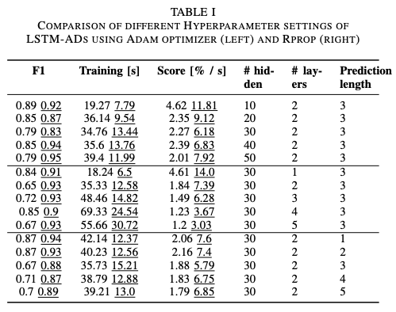
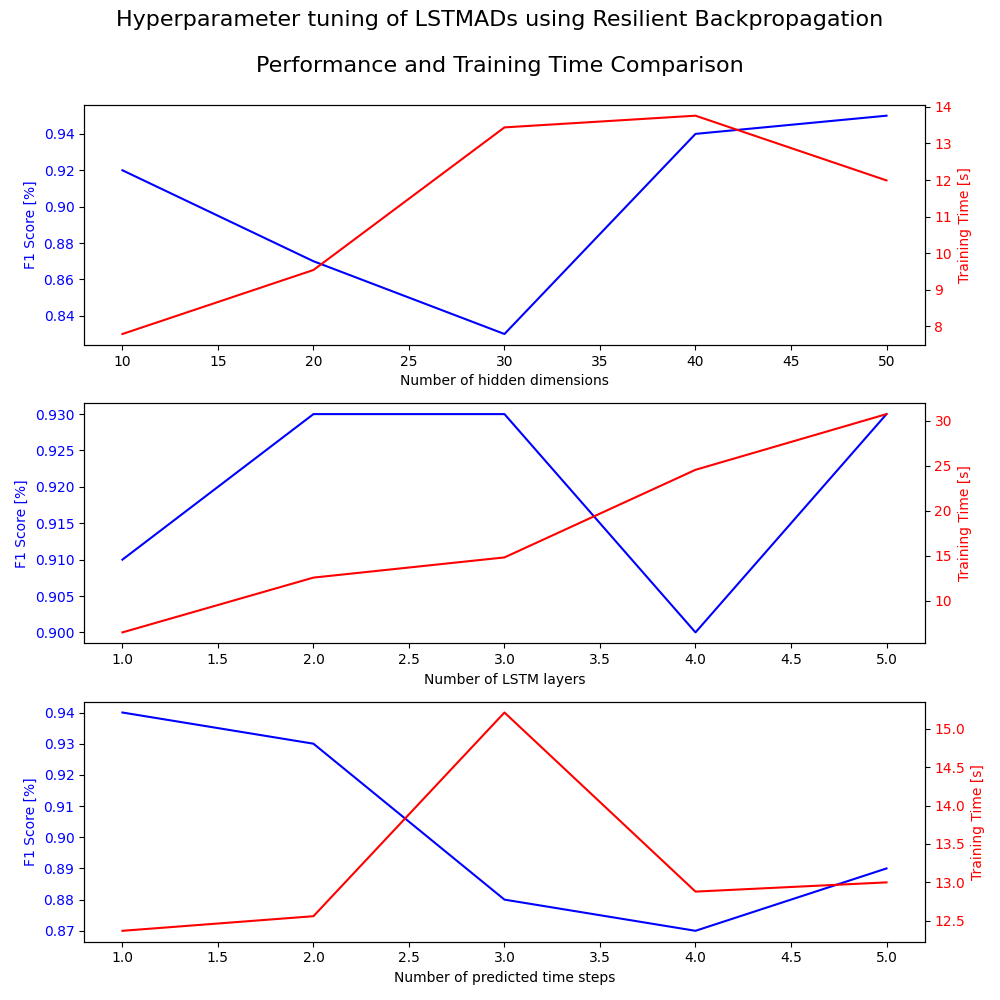

# LSTM-ADs
This project compares different implementations of Long short term memory networks for anomaly detection in time series (LSTM-AD) using the TimeSeriesBench benchmark.



## Getting Started
1. [Experiment report](./experiment-report.pdf)
2. [LSTM-ADs paper](https://www.semanticscholar.org/paper/Long-Short-Term-Memory-Networks-for-Anomaly-in-Time-Malhotra-Vig/8e54dd2b426b8d656a77c155818a87dd34c40754)
3. [TimeSeriesBench paper](https://arxiv.org/abs/2402.10802)
4. [TimeSeriesBench website](https://adeval.cstcloud.cn/content/home#home)
5. [TimeSeriesBench GitHub repository](https://github.com/CSTCloudOps/EasyTSAD)

## Do your own experiments

1. Fork and clone the repository.
```bash
git clone https://github.com/FabianHildebrandt/LSTM-ADs.git
```

2. Go to the main directory. 
```bash
cd LSTM-ADs
```

3. Download the datasets from the following [GitHub repository](https://github.com/CSTCloudOps/datasets) and place them in the *LSTM-ADs* directory.

4. Install the dependencies.
```bash
pip install -r requirements.txt
```

5. Run the experiments.
```bash
python experiments.py
```

6. Feel free to adjust the code and run your own experiments.